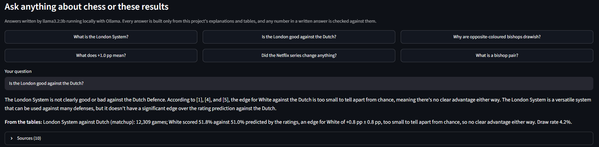
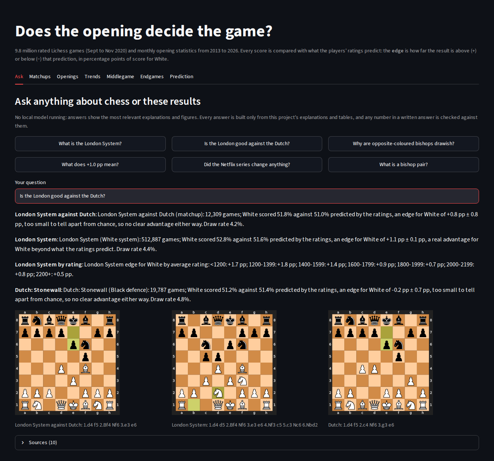
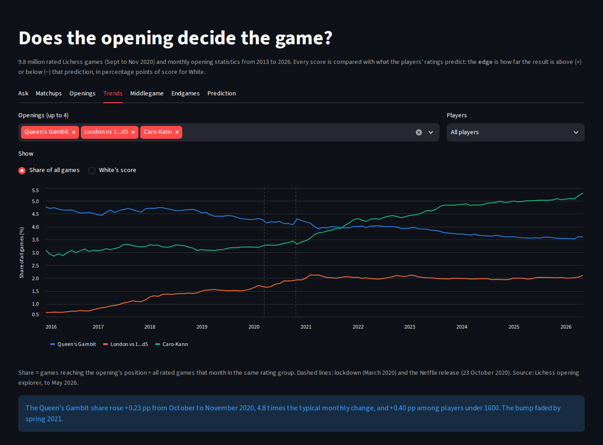
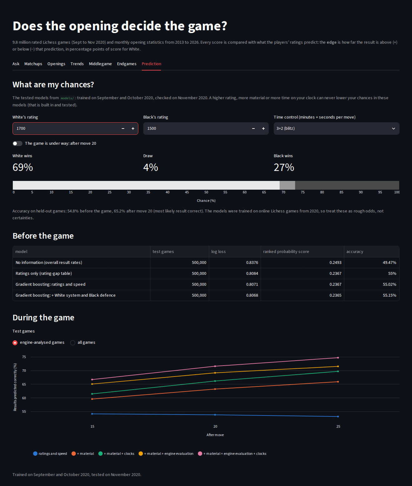
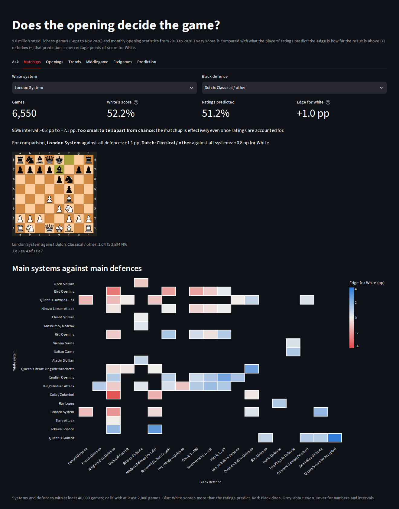

# Chess Strategy Analytics

[](https://github.com/thrijwal-k/chess-strategy-analytics/actions/workflows/ci.yml)
[](https://chess-strategy-analytics.streamlit.app)

Does the opening decide the game? This project measures how much each phase of a chess game (opening,
middlegame, endgame) tells us about the result once player strength is accounted for, and models how the
popularity and success of openings change month by month from 2013 to 2026, using the Lichess open database.

The full research plan is in [docs/PLAN.md](docs/PLAN.md). Results on 9.8 million games, plus monthly trends from
2013 to 2026, are in [docs/RESULTS.md](docs/RESULTS.md). [analysis/README.md](analysis/README.md) reproduces every
table and figure. The full dissertation-style report is [report/main.pdf](report/main.pdf) (LaTeX source in `report/`).

## Dashboard

**Live demo: https://chess-strategy-analytics.streamlit.app** (no installation needed; the Ask tab there shows
explanations, figures and boards, and writes full answers when run locally with Ollama).

To run it yourself:

```bash
pip install -r requirements-app.txt
streamlit run app.py
```

Seven tabs. **Ask** explains chess and the results in plain language to someone who has never played (see below).
The others: pick any White system and Black defence (for example London vs Dutch) and see the score against the
rating prediction; a heatmap of the main matchups; every opening's edge; monthly trends from 2013 to 2026 with
the lockdown and *The Queen's Gambit* marked; middlegame features and draw rates; endgame conversion rates; and the
prediction models with a "What are my chances?" calculator. It reads only the small summary tables in `docs/tables`
and the saved models in `models/` (1.3 MB), so it starts instantly.

**Ask**, with answers written by a free local model (llama3.2:3b) and the figures added straight from the tables:



Answers that name an opening or a chess idea come with chessboards of it:



**Trends**, 2013 to 2026, with the lockdown and the Netflix release marked:



**Prediction**: the "What are my chances?" calculator on the tested models:



**Matchups**: any White system against any Black defence, and the main pairings as a heatmap:



## Ask: a free explainer for beginners

The Ask tab answers questions such as "What is the London System?", "Is the London good against the Dutch?" or
"Why are opposite-coloured bishops drawish?". It is retrieval-augmented generation that costs nothing to run:

1. **Retrieve.** A beginner's knowledge base (`docs/knowledge`: the pieces, rules, openings, middlegame ideas,
   endgames and the project's terms) and `docs/RESULTS.md` are split into sections and searched with BM25.
2. **Look up facts.** Openings named in the question (including everyday names such as "the London" or "the
   Dutch") are matched against the results tables, and their exact numbers are added as sources.
3. **Write.** If [Ollama](https://ollama.com) is running on your computer, a small free model writes the answer
   from those sources only. Every number in the answer is checked against the sources; if any number is not
   there, the answer is replaced by the sources themselves. Without Ollama, the tab shows the most relevant
   sources, so it always works.

Questions that are not about chess or this project are refused.

To have answers written in plain sentences (free, runs offline on your computer):

```bash
# 1. install Ollama from https://ollama.com/download (Windows, macOS, Linux)
# 2. download a small model, about 2 GB (or llama3.2:1b, about 1.3 GB, for a slower computer)
ollama pull llama3.2:3b
# 3. start the dashboard as usual; the Ask tab finds the model on its own
streamlit run app.py
```

Set `OLLAMA_MODEL=llama3.2:1b` to use another model, `EXPLAINER_NO_LLM=1` to switch the model off, and
`OLLAMA_URL` if Ollama runs elsewhere (from the Docker image: `-e OLLAMA_URL=http://host.docker.internal:11434`).

`tests/explainer_eval.yaml` holds 39 questions: 32 with the source each must retrieve and the numbers some answers must
contain, and 7 that must be refused; the tests check retrieval (at least 95% correct), refusals, the numbers
and the number check. `scripts/eval_explainer_llm.py` asks the same questions to a real model and reports how many
answers were kept. With `llama3.2:3b` on a laptop (October 2026): 30 of 32 answers kept, the other 2
replaced by their sources because they contained a number not in them, all 7 off-topic questions refused, every
expected table figure present, and about 4 seconds per answer.

## Model tests

The prediction models are tested for chess sense, not only accuracy. `src/chessanalytics/models.py` predicts loss,
draw or win for White with two gradient-boosted models on the ordered result, with monotonic constraints, and
`scripts/train_models.py` trains two of them on September and October 2020 and saves them with 50,000 held-out
November games each in `models/` (1.3 MB):

| Model | Inputs | Accuracy | Log loss |
|---|---|---|---|
| Before the game | rating gap, average rating, speed | 54.8% | 0.808 |
| After move 20 | the same, material, both clocks, time control | 65.2% | 0.750 |

`tests/test_models.py` checks:

- **Behaviour**: probabilities are valid and sum to 1; a higher rating gap, more material or more time on White's
  clock never lowers White's chances; swapping the colours swaps the win and loss chances apart from White's small
  first-move edge; common-sense cases (400 points stronger wins over 75%; a queen up on real games wins over 80%;
  in bullet, being far behind on the clock costs at least 15 points); the constraints hold even for a model
  trained on noise.
- **Quality gates**: accuracy and log loss no worse than the levels in `docs/RESULTS.md`, clearly better than
  knowing nothing, the position model at least 5 points more accurate than ratings alone, and the saved models
  still reproduce the metrics recorded when they were trained.
- **Calibration**: for loss, draw and win, predicted chances are within 3 points of how often it happened.

What the models are for, their data, measured performance and limits are in [docs/MODEL_CARD.md](docs/MODEL_CARD.md).
The dashboard's Prediction tab has a "What are my chances?" calculator built on them. The saved models are tied to
scikit-learn 1.8; after an upgrade, retrain with
`python scripts/train_models.py --data data`.

## CI/CD

GitHub Actions (`.github/workflows/ci.yml`) runs on every push and pull request:

| Stage | What it checks |
|---|---|
| Lint | `ruff` on all Python code, `hadolint` on the Dockerfile |
| Tests | 251 tests on Python 3.11 and 3.12 (including the explainer, board, model and forecast-check tests), with line coverage and the saved models' accuracy in the run summary |
| Pipeline smoke test | `scripts/smoke_pipeline.py`: extract, features, setup labels, settled endgames, clocks and the lite copy on the sample games; every stage must keep one row per game and the known games must get the right labels |
| Dashboard smoke test | starts `app.py` (explainer without a model) and checks the health endpoint and the page |
| Explainer with a real model (manual) | run the workflow by hand with "llm_eval" ticked: installs Ollama on the runner, pulls a small free model and asks every evaluation question |
| Docker | builds the dashboard image (cached), runs it, waits for the health check and confirms it runs as a non-root user |
| Publish (push to `main` or a `v*` tag) | pushes the image to GitHub Container Registry as `latest`, the commit SHA and the version |
| Release (`v*` tag) | creates a GitHub release with the results, figures and tables attached |

A second workflow, **Monthly forecast check** (`.github/workflows/forecast-check.yml`), runs on the 10th of every
month. `scripts/forecast_check.py make` saved 12-month ARIMA forecasts with 95% intervals for 12 opening shares
(`docs/tables/forecasts.csv`, from data up to May 2026); the monthly job downloads the months since then from the
Lichess opening explorer and reports how many real values fell inside the intervals and how the error compares
with simply repeating the last known share. It needs a Lichess token saved as the repository secret
`LICHESS_TOKEN`; without one it is skipped with a note.

Dependabot opens weekly pull requests for Python packages, GitHub Actions and the Docker base image.

Run the published dashboard anywhere with Docker:

```bash
docker run -p 8501:8501 ghcr.io/thrijwal-k/chess-strategy-analytics:latest
```

For a free public link, connect the repository to [Streamlit Community Cloud](https://share.streamlit.io): New app,
pick the repository, main file `app.py`, and under Advanced settings choose Python 3.12. It redeploys on every push
to `main`. Online there is no local model, so the Ask tab shows the matching explanations, figures and boards
instead of written answers.

## Status

| Phase | Work | Status |
|---|---|---|
| 1 | Opening classifier (all 3,865 named lines), White system / Black defence detectors, streaming PGN reader, tests, CI | Done |
| 2 | Middlegame structure and endgame features, run on 10.1 million games | Done |
| 3 | Monthly opening time series 2013 to 2026, forecasting backtests, change points (lockdown, *The Queen's Gambit*) | Done |
| 4 | Rating baseline, opening effects, prediction models (before and during the game), dashboard | Done |
| 5 | Report ([report/main.pdf](report/main.pdf)), dashboard, explainer, tested models | Done |

## What Phase 1 does

**Every named opening.** Each game is labelled with the deepest position it reaches in the Lichess opening
catalogue: 3,865 named lines, 500 ECO codes, 150 families. Positions are matched rather than move orders, so
`1.Nf3 d5 2.d4 Nf6 3.c4 e6 4.Nc3` and `1.d4 d5 2.c4 e6 3.Nc3 Nf6 4.Nf3` both come out as *Queen's Gambit
Declined: Three Knights Variation*. A test replays all 3,865 lines and checks each one comes back with its own name.

**White system vs Black defence.** The catalogue splits one system across several names. The London System
appears under at least four catalogue families depending on Black's reply (*Queen's Pawn Game*, *Indian
Defense*, *London System*, *Dutch Defense*). So each side is also labelled from where its own pieces went in its
first 10 moves, independently of move order: 32 White labels (London, Jobava London, Colle, Catalan, Ruy Lopez,
the anti-Sicilians and others) and 38 Black labels (Sicilian, Caro-Kann, King's Indian, the three Dutch setups
and others), each including catch-all groups so every game gets a label. That gives the matchup matrix, e.g. **London vs Dutch**.

Only pairings that can happen on the board exist: the London (1.d4) can never meet the Caro-Kann (a reply to
1.e4), and the Queen's Gambit and King's Gambit are both White openings.

**Streaming reader.** A Lichess month is about 30 GB compressed. The reader decodes zstd as a stream, reads
straight from a URL, can stop after a byte budget (to sample the start of a month), and keeps engine
evaluations (`[%eval]`, including mate scores) and clock times (`[%clk]`) for every move. Usernames are dropped.

## Run it

```bash
pip install -r requirements.txt
python -m pytest -q                       # 251 tests

# one row per game: ratings, speed, result, named opening, ECO, White system, Black defence
PYTHONPATH=src python -m chessanalytics.extract tests/fixtures/sample_lichess.pgn --out out/games.csv

# on your own computer: sample the first 1 GB of several Lichess months straight from the server
python scripts/sample_months.py 2020-09 2020-10 2020-11 --gb 1 --workers 4

# phase 2: middlegame and endgame features from the saved moves (no download needed)
python -m chessanalytics.features data/games/games_2020-09.parquet --out data/features/features_2020-09.parquet --workers 4
```

## What Phase 2 measures

After moves 15, 20 and 25, for each side: material, isolated, doubled, backward and passed pawns, pawn islands,
isolated queen pawn, hanging pawns, bishop pair, bad bishop, knight outposts, rooks on open and half-open files
and the 7th rank, king position, pawn shield, open files near the king, centre control, space and development.
For the whole game: when and where each side castled (including opposite-side castling) and when the queens came
off. The endgame starts at the first position with 26 points or less of non-pawn material on the board, and is
classified into 14 types (rook, opposite-coloured bishops, bishop vs knight, queen, rook vs minor piece and
others) with the pawn and material balance at that moment. Where the game has engine analysis, the evaluation
at each snapshot and its change over the next 10 moves are kept.

Every feature is tested on hand-built positions with a known answer, and the endgame detection is cross-checked
against an independent replay of random legal games.

`tests/fixtures/sample_lichess.pgn` contains five hand-written games in Lichess format for testing the reader.
They are not real games.

## Layout

| Path | Purpose |
|---|---|
| `src/chessanalytics/openings.py` | Catalogue loader and deepest-position classifier |
| `src/chessanalytics/setups.py` | White system and Black defence detectors |
| `src/chessanalytics/pgn_stream.py` | Streaming PGN / zstd reader with eval and clock parsing |
| `src/chessanalytics/extract.py` | Games to a table (Parquet or CSV), with multiprocessing; keeps moves, evals and clocks |
| `src/chessanalytics/middlegame.py` | Pawn structure, piece, king safety, space and development features |
| `src/chessanalytics/endgame.py` | Endgame detection and 14-type classification |
| `src/chessanalytics/features.py` | Runs the middlegame and endgame features over a saved games table |
| `src/chessanalytics/explainer.py` | The Ask tab: retrieval, facts from the tables, Ollama client, number check |
| `src/chessanalytics/models.py` | Monotonic loss/draw/win models used by the model tests and the calculator |
| `src/chessanalytics/boards.py` | Chessboard diagrams of openings and ideas for the dashboard |
| `scripts/sample_months.py` | Samples Lichess monthly files over HTTP |
| `scripts/train_models.py` | Trains and saves the tested models |
| `scripts/forecast_check.py` | Saves opening-share forecasts and checks them against new months |
| `docs/MODEL_CARD.md` | What the result models are for, their data, performance and limits |
| `docs/screenshots/` | Dashboard screenshots used in this README |
| `docs/knowledge/` | Beginner's knowledge base for the explainer |
| `models/` | Saved models and held-out test games |
| `data/openings/` | Lichess opening catalogue (CC0) |
| `docs/PLAN.md` | Research questions, methods, report outline, timeline |

## Data and licences

Code: MIT licence (`LICENSE`). Lichess game database and opening catalogue: CC0 (public domain).
