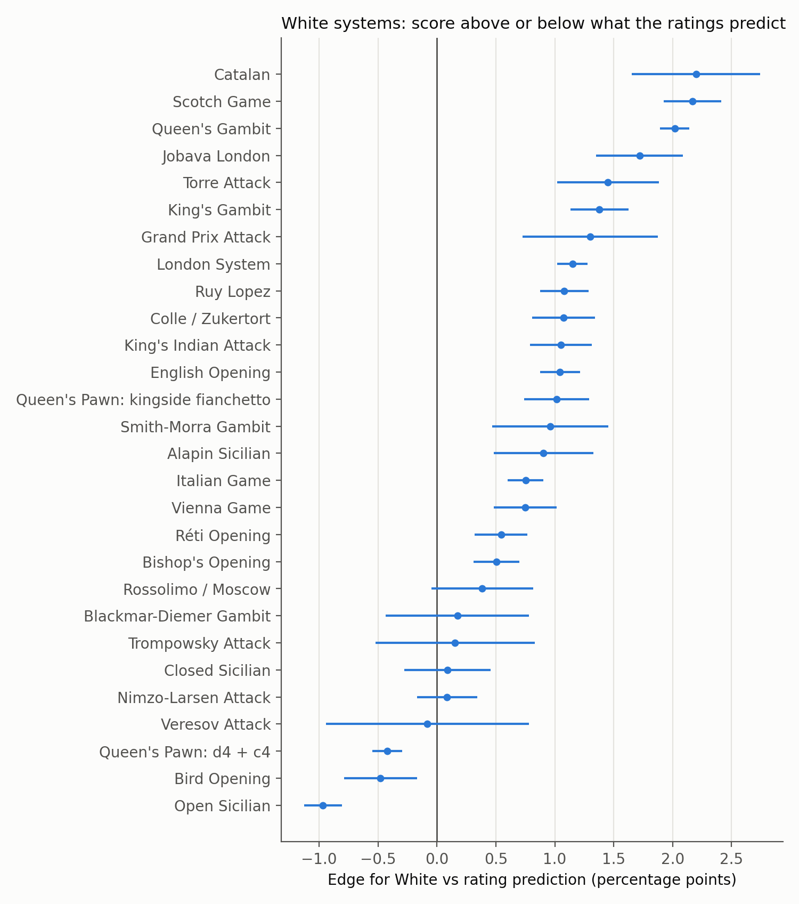
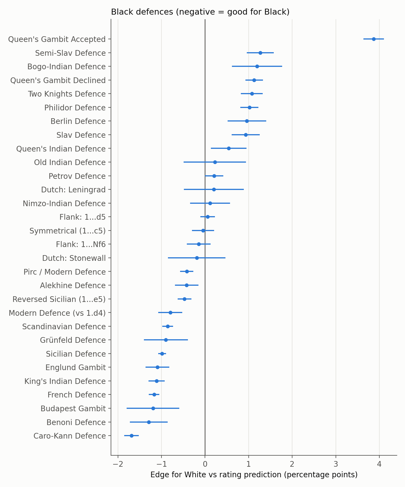
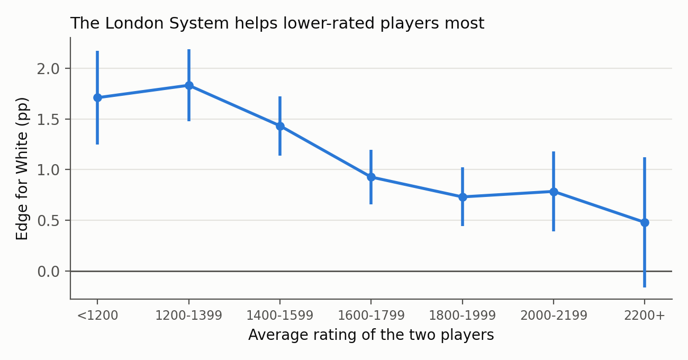
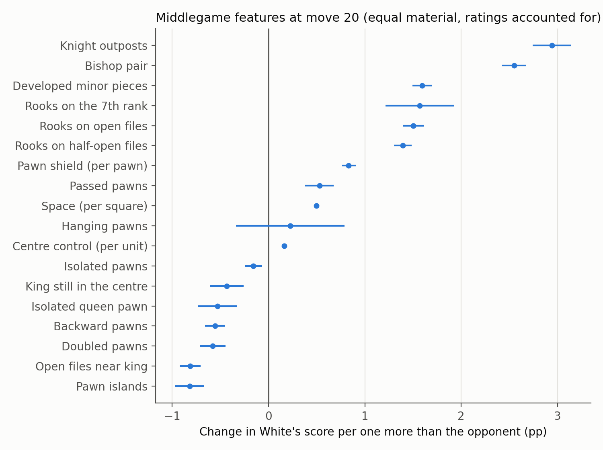
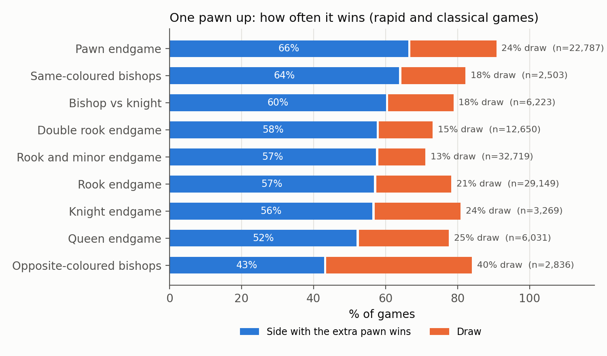
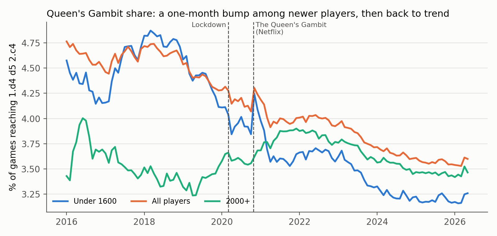
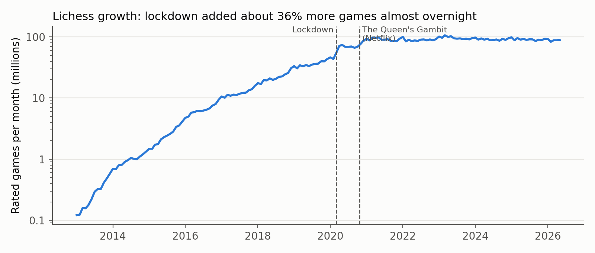
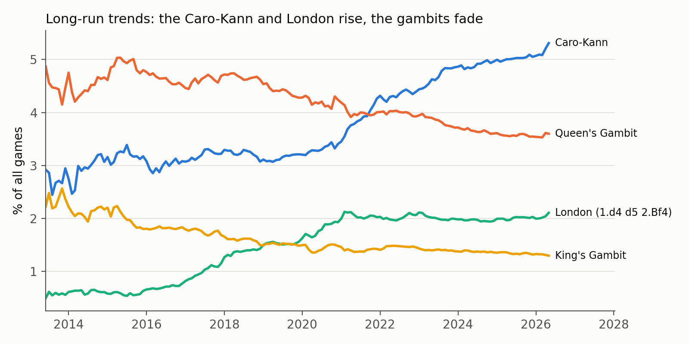
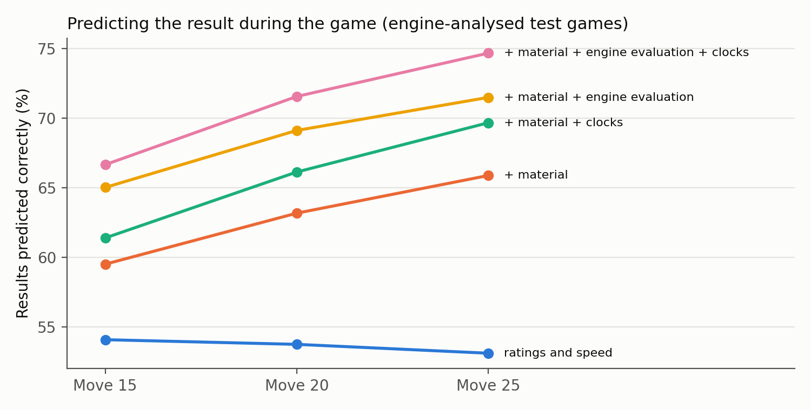

# Results

**Data.** 10,149,917 Lichess games: the first 1 GB of the September, October and November 2020 files, which covers
1 to 2 September, 1 to 2 October and 1 to 2 November. After keeping rated bullet, blitz, rapid and classical games
that ended normally or on time and lasted at least 5 moves, **9,769,932 games** are analysed (51% blitz, 35% bullet,
14% rapid, 1% classical). White scores 51.6% and 4.1% of games are drawn.

**Baseline.** Every result is compared with what the ratings predict: the average score of games with the same
rating gap (25-point bins), rating level (200-point bands) and speed. "Edge" means the score above or below that
prediction, in percentage points (pp), with a 95% confidence interval.

The plain Elo formula overrates favourites on Lichess: at a 600-point gap it predicts 97%, but players 600 or more
points stronger score 93% (at 300 points: 85% predicted, 79% observed; `docs/tables/elo_calibration.csv`). That is why the baseline is fitted from the data rather than taken from the formula.

## RQ1 Openings

- 3,007 of the 3,865 named openings and 499 of the 500 ECO codes appear in the sample.
- **Opening effects are small next to ratings.** The largest effects are about 4 pp (Queen's Gambit Accepted +3.9 for
  White; Benko Gambit −3.9 for White). A 100-point rating gap is worth about 10 pp.
- Best White systems relative to ratings: Catalan +2.2, Scotch +2.2, Queen's Gambit +2.0, Jobava London +1.7.
  The Open Sicilian is −1.0 (Figure 1).
- Best Black defences relative to ratings: Caro-Kann −1.7, Benoni −1.3, French −1.2, King's Indian −1.1, Sicilian −1.0
  (Figure 2).
- **London vs Dutch** (12,309 games): +0.8 ± 0.8 pp for White, not distinguishable from zero. By setup: Leningrad
  −0.4 ± 2.0, Classical +1.0 ± 1.2, Stonewall +1.3 ± 1.6. The London's hardest opponent is the King's Indian
  (−2.2 ± 0.5, 33,950 games).
- **The London is a club player's weapon.** Its edge falls from about +1.8 pp below 1400 to +0.5 (not significant)
  above 2200 (Figure 3).

## RQ2 Middlegame (position after move 20, equal material)

Linear model of White's edge on White-minus-Black feature differences, 2.2 million games with equal material at
move 20, robust standard errors (Figure 5):

- Knight outpost +2.9 pp, bishop pair +2.5, developed minor piece +1.6, rook on the 7th +1.6, rook on an open file
  +1.5, rook on a half-open file +1.4, each extra pawn in the king's shield +0.8, passed pawn +0.5.
- Pawn islands −0.8, open file next to the king −0.8, doubled pawn −0.6, backward pawn −0.6, isolated queen pawn
  −0.5, king still in the centre −0.4.
- Measured per typical difference between players, **space** has the largest effect (+2.3 pp per standard
  deviation).
- The same signs hold for all positions with material differences controlled (1.5 million game sample).
- In the 5.8% of games with engine analysis, most features do not change the evaluation over the next 10 moves
  once the evaluation at move 20 is known: the engine already prices them in. Passed pawns and space still help.

These are associations, not causes: stronger play produces good structures as well as wins.

**Castling and queen trades** (draw rates compared with the rating prediction; `docs/tables/draws.csv`):

- Opposite-side castling makes games sharper: 3.8% draws against 4.7% when both sides castle on the same side
  (−0.3 and +0.4 pp against the prediction). In rapid and classical: 4.6% against 5.6%.
- Trading queens makes draws far more likely: 6.8% to 8.4% draws when the queens come off, against 1.7% when they
  stay on. In rapid and classical, games where the queens come off after move 30 are drawn 10.6% of the time.
  Part of this is game length: games that keep their queens include many quick wins and losses on time.

## RQ3 Endgames

An endgame type is counted once the material has stayed the same for 4 plies, so positions in the middle of an
exchange are not misclassified. 4.55 million games reach a settled endgame.

- **Opposite-coloured bishops are the drawish ending the books say.** With one pawn up in rapid and classical games
  the stronger side wins only 43% (40% draws), against 66% in pawn endings and 57% in rook endings (Figure 4).
  With equal material they are drawn 46% of the time, the highest of any type.
- **"All rook endings are drawn" does not hold at this level.** One pawn up in a rook ending wins 57% and draws
  21% in rapid and classical; 55% and 15% in bullet and blitz.
- **Pawn endings are the most decisive** (one pawn up wins 66%; two pawns up 84%).
- Queen endings are hard to convert (52% with an extra pawn), harder than rook endings.
- Slower time controls draw more in every type.
- With equal material, White's first-move edge has gone by the endgame: White scores about 1.5 pp below the
  rating prediction, which includes that edge.

## RQ4 Opening trends, 2013 to 2026

**Data.** Monthly White wins, draws and Black wins from the Lichess opening explorer for 40 positions in four rating
groups (all players, under 1600, 1600 to 1999, 2000 and above), January 2013 to May 2026 (the explorer runs a few
months behind). Each opening's *share* is the games reaching its position divided by all rated games that month in
the same group, which keeps months comparable while Lichess grew from 0.1 million to about 90 million rated games
a month. Early years have few games, so the trend tests use 2016 onwards. Reproduce with `analysis/rq4_trends.py`.

**Lockdown.** The number of rated games jumped by about 36% in March and April 2020 (interrupted time series on log
games per month: +0.31 ± 0.08), on top of the existing growth (Figure 7).

**The Queen's Gambit (Netflix, 23 October 2020).** The share of games reaching 1.d4 d5 2.c4 rose from 4.07% in
October to 4.30% in November 2020 (+0.23 pp), 4.8 times the typical monthly change. No other year comes close: the
October-to-November change in 2016 to 2025 was between −0.05 and +0.03 pp. The bump was largest among players under
1600 (+0.40 pp, 5.1 typical changes) and absent above 2000 (+0.06, 1.0), which fits an influx of new players
inspired by the series. It did not last: the share was back on its long decline by spring 2021, and an interrupted
time series shows no lasting level change (+0.01 ± 0.11 pp). Placebo tests at six other Novembers flag a
significant "change" in four of them, so that method is too noisy here to support a stronger claim (Figure 6).

**Long-run trends** (share of all games, 2016 to May 2026; Figure 8):

- The London System (1.d4 d5 2.Bf4) more than tripled, from 0.66% to 2.11%, with most of the rise between 2018 and
  early 2021.
- The Caro-Kann rose from 3.1% to 5.3%, fastest between 2020 and 2023. The Sicilian fell from 11.5% to 9.4%.
- The Queen's Gambit fell from 4.8% to 3.6% and the King's Gambit from 1.8% to 1.3%.
- The two largest breaks in many openings fall in early 2021 and 2023, at the same time across unrelated
  openings. That points to changes in who was playing on Lichess (the post-2020 chess boom), not to anything about
  the openings themselves.

**Forecasting.** Rolling-origin backtests on 12 opening shares (12-month horizon, origins every 6 months, 156
forecasts per method): ARIMA mean MASE 0.64, ETS 0.65, seasonal naive 0.96. Both models beat the seasonal naive baseline for
every opening; ARIMA was best for 8 of 12 openings and ETS for 4. Opening shares move slowly and smoothly, so a
year ahead is forecast with a typical error of about 2.5% of the share (median sMAPE).

## RQ5 Predicting the result

Models are trained on September and October 2020 and tested on November 2020, so they are always judged on games
played after their training data. Scores: log loss and ranked probability score (lower is better), and accuracy
(the share of games where the most likely result was the actual one).

**Before the game** (500,000 test games, `docs/tables/pregame.csv`):

| Model | Log loss | RPS | Accuracy |
|---|---|---|---|
| No information (overall result rates) | 0.838 | 0.249 | 49.5% |
| Ratings only (rating-gap table) | 0.808 | 0.237 | 55.0% |
| Gradient boosting: ratings and speed | 0.807 | 0.237 | 55.0% |
| + White system and Black defence | 0.807 | 0.237 | 55.1% |

Ratings carry almost all of the information; knowing both sides' openings adds 0.13 points of accuracy, which
matches RQ1. The model is well calibrated: when it gives White a 70–80% chance, White wins 74% of the time.

**During the game** (`docs/tables/ingame.csv`; Figure 9). Two test sets: a 500,000-game sample of all November
games, and every November game with engine analysis (the analysis is only available for 5.8% of games). Clock
times are each player's time left after their own move, as a share of the starting time.

All games:

| After move | Ratings and speed | + material | + material and clocks |
|---|---|---|---|
| 15 | 54.9% | 58.3% | 61.3% |
| 20 | 54.4% | 60.8% | 65.1% |
| 25 | 53.8% | 62.9% | 68.6% |

Games with engine analysis:

| After move | Ratings and speed | + material | + material and clocks | + material and engine | + material, engine and clocks |
|---|---|---|---|---|---|
| 15 | 54.1% | 59.5% | 61.4% | 65.0% | 66.7% |
| 20 | 53.7% | 63.2% | 66.1% | 69.1% | 71.5% |
| 25 | 53.1% | 65.9% | 69.7% | 71.5% | 74.7% |

- By move 25 the position predicts the result far better than the ratings do.
- **Clock times matter almost as much as material.** Across all games at move 25 they add 5.7 points of accuracy
  on top of material (62.9% to 68.6%; log loss 0.777 to 0.708). Most games are bullet and blitz, where running out
  of time decides many results (32% of the analysed games ended on time).
- The clocks matter most in fast games. At move 20 they add 8.0 points of accuracy in bullet (59.4% to 67.4%),
  3.0 in blitz, 0.6 in rapid and 0.1 in classical (`docs/tables/ingame_clocks_by_speed.csv`).
- The engine evaluation and the clocks measure different things and add up: with both, 74.7% of engine-analysed
  games are predicted correctly at move 25 (log loss 0.602, against 0.651 with the engine evaluation alone).

## Corrections made along the way

Cross-checking the setup labels against the catalogue names on the real data found two rules that were too loose:
London (it caught the Englund trap 1.d4 e5 2.dxe5 ... 4.Bf4) and Scotch/Italian/Ruy Lopez (they caught Philidor lines
without 2...Nc6). Both were fixed, relabelled from the saved moves (3% of games changed) and covered by tests. A
third, smaller one (Philidor lines with an early ...Nf6 labelled Two Knights) is fixed in the code and tested; the
published tables still use the earlier labels, which differ for under 0.1% of games. Running
`scripts/relabel_setups.py` and the analysis scripts again brings them up to date.

## Still to do

- The report.
- Re-run the setup labels with the third fix (see above).
